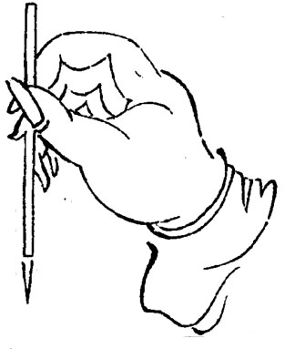

笔法精解
========

执笔指法
--------

执笔有双钩、单钩之说。单钩者，搦管于指骨之首节也；双钩者，搦管于指骨之次节也。“指”谓食指、中指。此图系单钩式——掌虚、腕悬、指密、管直。

大指上骨节出，大指、中指、食指三指尖钩笔。名指爪肉之际，揭笔令向上。中指、名指两相抵住。

腕竖则锋正，锋下则四面势全。次实指，指实则筋力均平。次虚掌，掌虚则运用便易。

五指齐用力，而肘腕助之。指之执管宜浅，易于运转。若置笔当指节弯处，则碍转动。真书执笔宜近头，行书宜稍远，草书宜更远。远取点画长，大，近取分布齐均。

执笔须坚，运笔须疾，笔法须活。

指法名目
--------

是章言体也，也动也。前人谓之拨镫法，谓如善御者之仅以足尖踏镫也，或谓执笔之势，仿佛指尖持物，以挑拨镫心者，然也。

**撅**： 大指上节端用力，与食指撅笔。

**压**： 食指压之，亦用指端。

**钩**： 中指尖钩笔。

**贴**： 笔管贴着名指爪肉之际，此指得力，字无不精。

**辅**： 小指紧靠名指后。

指法运用名目
------------

是章言用也。用者，运转时往来顺逆之道也。运用之法，小字运指，中字运腕，大字运肘。盖寸以内，法在指掌；寸以外，法兼肘腕。

**推**： 名指从右平推至左。横画超势用之。从下直推至上，直划起势用之。又小指亦推名指过左。

**揭**： 名指爪肉之际，抬笔管向上。

**抵、拒**： 名指、中指两指相资籍为用，名指揭笔而中指节制之。

**导**： 小指引名指过右。

**送**： 小指送名指过左。大字尽一身之力而送之。

**卷**： 笔笔相生，意思连属，势如卷出。盖力到笔到，旋转如打圆圈也。知卷则字无不一气贯注。

肘腕用法
--------

大字推送，即用肘腕。但以肘腕论，其名又微有别耳。

**悬肘**： 大字用之。

**虚肘、悬腕**： 中字用之。

**虚腕**： 小字执笔近头，肘腕不着案，似虚其中。

指腕形势
--------

**名指揭上**： 作仰画及竖之起笔，至上半截并用之。

**双指钩下**： 谓名指、中指，直划力行用之。

**斜指抬笔**： 挑法用之。

**右揭腕、指左斜**： 小指与下腕向右下行笔亦轻抬而出，撇法用之。指法之“卷”，其形势亦如此。

**左揭腕、指右斜**： 双钩笔用力抵拒，背抛、戈法用之。

笔管形势
--------

**正直**： 起笔、收笔、正直以待作书及其运也，上、下、斜、侧，惟意所使，至笔即定，端若引绳，此之谓笔正。

**向上**： 名指揭上笔管，下节随之上。

**向下**： 双指钩下笔管，下节随之下。

**向上左斜**： 直划须推上，笔管下节向上左出作斜势落下。又须左顾右势，笔管先斜而后落。

**向右下斜**： 字之收笔，有用此势者。用意拱对字之中心，惟预想字形方能解此。

笔法名目
--------

是章言笔画已着纸，凡法俱在画中，有形象可寻者也。

**提**： 顿后必须提，蹲与驻后亦须提。提者，以笔提起，减于顿之分数、及蹲与驻之分数也。先有落笔，后有提笔，提笔之分数，亦看落笔之分数。

**转**： 围法也，有圆转回旋之意。

**折**： 笔锋欲左先右，往右回左也。直划上下亦然。

**顿**： 力注笔端，透入纸背，笔重按下。

**挫**： 顿后笔略提，使笔锋转动，离于顿处。凡转角及趯用之。挫有分寸，过则脱节，不及则气促。

**蹲**： 用笔如顿，特不重按。

**驻**： 不可顿、不可蹲，而行笔又疾；不得驻、不得迟涩审顾则为驻。凡勒画起止用之。又平捺曲处用之之。力聚于指，流于管，注于锋，力透纸背者为顿，力减于顿者为蹲，力到纸即行笔为驻。

**抢**： 笔意与折同。折之分数多，抢之分数少，折之分数实，抢之分数半虚半实。圆蹲直抢，偏蹲侧抢，出锋空抢。空抢者，取折之空势也。笔燥则折，笔湿则抢；笔燥实抢，笔湿空抢。用抢分寸，仍随落笔之大小轻重。

**尖**： 用于承接处。

**搭**： 笔锋搭下也。上笔带起下笔，上字带起下字。

**侧**： 指法运用，侧势居半，直划尤宜以侧取势。

**衂**： 笔既下行，又往上也。与回锋不同，回锋用转，衂锋用逆。

划须平，竖要直；
分左右，辨轻重；
明上下，学布白；
知收放，量分寸；
讲笔法，审偏让，识次序。

初学宜用湖笔。童子指腕力弱，借笔毫以助之，至笔法纯熟可随意施用。

以上诸法，名家所不能废，然初学即宜习之，自指法第二以下，则俟功候将至，学力可成，纵观诸贴，自能解领 —— 仲和记。

指法名目第二
----------------

**拖**： 五指齐用力向下，或右行有之。

**曳**： 拖与曳相似，其稍异者，曳法略具顿跌，又似勒意、似挫意，捺法抑而复曳。

**撚**： 撚者，用笔之机也。盖作字贵乎结构，结构具矣，字形贵活。字形活矣，又在点划等活。惟撚笔方知其妙。如户枢之转。

笔法名目第二
------------

**过**： 十分疾过。凡字有一主笔，虚舟老人所谓立柱是也。主笔须平正，他画则错综用意。作楷知此，便不呆板。

**纵**： 笔势放开，所谓大胆落笔也。学李背海书则知操纵之法。《书谱》云：既知平正，务追险绝；既知险绝，复归平正。

**劲**： 善用纵笔，必以劲取胜。盖纵而能劲，则竖实。

**打**： 空中落笔。

**战掣**： 初学提活蹲轻则肉圆，老成提紧力行则肉战掣。所谓如万风枯藤也，山谷书多战掣，今学之者皆矫。[#f1]_

**出锋**： 秃颖作书，谬矣。唐宋碑刻，无不芒铩铦利。运笔之法，斜正、上下、平侧、偃仰，八面出锋，始筋骨内含精神，外露风彩，焕发亦有神。

**沉着**： 诸法纯熟，笔无游移，方能沉着。先君子论书云：笔画如刻，结构如铸，间用燥笔，如抽茧丝，惟知篆隶，方能得此。

**洁净**： 如皓月流天，无纤云蒙翳，从颜、柳起手，参与欧、虞，自得之。

**疾涩**： 宜疾则疾，不疾则失势；宜涩则涩，不涩则病生。疾徐在心，形体在字，得心应手，妙出笔端。

**跌宕**： 熟极而化，方能跌宕。此境不可强求，若勉强，非浮滑率易，则怪僻无度。

**丝牵使转**： 丝牵有形迹，使转无形迹。牵丝为有形之使转，使转乃无形之牵丝。

**渡**： 一划方完，即从空际飞渡以成二划。笔势乃紧乃劲，所谓形现于未划之先，神留于既划之后也。

**留**： 笔机往矣，要必有以收之。笔锋尽矣，要必有以延之。所以展不尽之情，蓄有余之势也。米老曰：无垂不缩，无往不收。

用墨
----

墨淡则伤神彩，太浓则滞笔锋。

研墨恰好，可以适用。过研则干燥滞笔。东坡用笔墨如糊，云湛湛如小儿目睛乃佳。古人作书，未有不浓。用墨者，晨起即磨汁升许，供一日之用。及其用也，则但取墨华，而弃其余滓，所以精彩焕发，经数百年而墨光如漆，余香不散也。至董文敏，始以画法用墨，初觉气韵鲜妍，久便暗暗无色。然其着意书，未有不浓用墨者，观者未这察耳。

行草用墨与真书不同。《书谱》云：带燥方润，将遂枯。《续书谱》云：燥润相杂，润以取妍，燥以取险。皆论行草用墨也。

----

.. [#f1] 本条目标题中的“战”，在原书是“䟐”，而“掣”则是（走利），但这个字用微软五笔打不出来，所以用了其他出版社出版的“战掣”代替。本条目解释中的“战掣”也是由此而来。