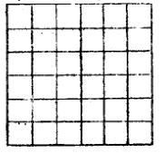
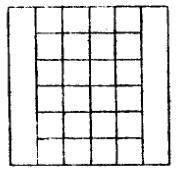
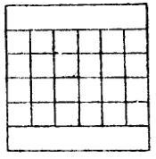
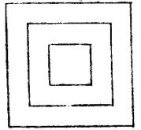

重定九宫格
=======================================

金壇蒋（骥）勉斋制。

唐人作书，专用法，遂有九宫，其旧制分中、左、右、上、下界画作九九之数，于于迷目。今重订九宫格，每宫界十字，共三十六格，仍分中及左、右、上、下，其减省用法，于均方减数之旨亦合焉。

-------------

**九宫全格**

**长字省两旁格**

**短字省上下格**

**九宫中得三层方格**

-------------

右格纵横六道，字长者用中直四道，两旁两道为隙地。字短者用中横四道，上下两道为隙地。九宫每宫界十字，中得方格三层。字方者，笔画到第二层线上；小者在第一层线外；字长如“美”，方如“囗”，短如“以”，小如“口”之类。如此则分寸仍是九宫旧规，用之较便。此格用之生字，易得主意。

临摹古贴，如字大者，以九宫格作小印促之；字小者，以九宫格作大印展之，察其屈伸；秋毫勿失其格。不必作六道分数，已可得矣。

------------

书法为士君子之余事，然不得其传而能臻其妙者，鲜矣。自吾祖湘帆公以写《十三经》为圣天子推重，一时学者，争契慕焉。迨府君亦精于翰简，有重定九宫格，减当精核，实为初学津梁。盖古贴字体如执柯，范金有可倚著，再用九宫，则得大治洪炉，志归镕铸。此脚踏实地工夫，不可忽也。壬寅秋日次男和谨识。