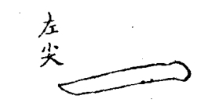
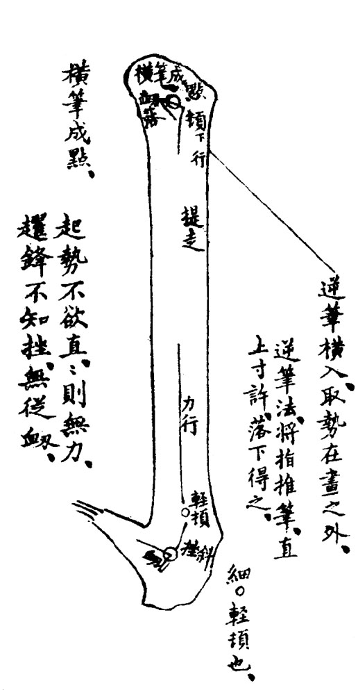

点画全图
===========

起手诀
~~~~~~~~~~~~~

童子作书，先教以手腕运用诸法，乃学点划体势。须使笔笔皆有准绳，既能点画，即讲明偏旁配合诸法，然后可论全字之结构，盖书法小道，亦有成规循序而进，不容躐等耳。

用粉版逐笔双钩刻上，看明笔意，习之如廓。填法用淡墨水写，可以辨毫端分寸。图中又有小圈，圈又略分大小，以别顿驻之轻重。

初学不妨有棱角，故图中间集欧体，使规矩可寻，确实依傍。由此神而明之，去方就圆，高出晋魏，亦存乎其人耳。

初学先宜大书，勿遽作小楷。从小楷入手者，以后作书皆无骨力。盖小楷之妙，笔笔要有意有力，一时岂能遽到。故宜先从径寸以外之字，尽力送足，使笔笔皆有准绳，乃可以次收小。古人先于点画及偏旁研究习熟，然后结字。

平画法
~~~~~~~~~

横画须直入笔锋，学横画先下笔成点，而后行也。

折起、衂落、成点、提走、力行、驻挫、顿围、提收。

.. image:: images/pinghuafa.jpg
   :align: center

蔡君谟专长如乌丝，以两帝如界也。横直皆然，图用双钩，近此意。

成点后转笔顿行，两端有〇，顿笔也，下仿此。

画中加黑线，以明笔意，下仿此。

画有宜用左尖者。凡接左向左处用之，如寸、才之在右旁是也。

.. image:: images/youjian.jpg
   :align: center

画有宜用右尖者。凡向右让右处用之。如木、扌之在左旁是也。

.. image:: images/le.jpg
   :align: center

斜指抬笔，笔管不得过直。勒意首尾俱低，中高拱如覆舟样。八法论曰：勒常患平，平如万斛舟之平稳；勒如轻舟疾过。大约字之画多者，必用勒画。如“書”字有八画，不可概用重笔。

直画法
~~~~~~~~~~

直画须横入笔锋。直画起锋处不用力，虽极短不得直。

侧起、衂落、成点、顿 :sub:`下行`、提走、力行、顿 :sub:`轻`、围满、提挫 :sub:`斜`、衂、重顿 :sub:`足`、提趯。

逆锋横入，取势在画之外。

横笔成点。

逆笔法，将指推笔，直上寸许，落下得之。

起势不欲直，直则无力。趯锋不知挫，无从衂。

