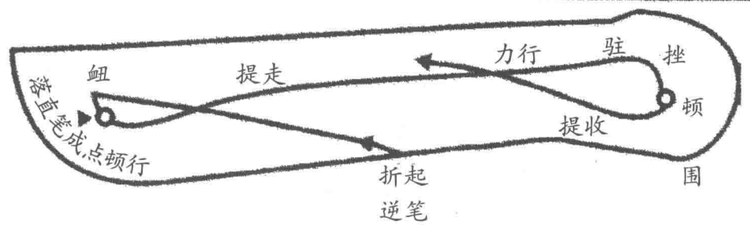
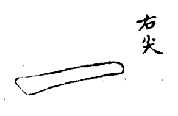
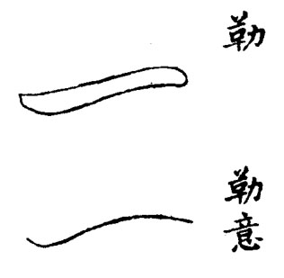

==============
平画法
==============

横画须直入笔锋，学横画先下笔成点，而后行也。

折起、衂落、成点、提走、力行、驻挫、顿围、提收。

蔡君谟专长如乌丝，以两帝如界也。横直皆然，图用双钩，近此意。

成点后转笔顿行，两端有〇，顿笔也，下仿此。

画中加黑线，以明笔意，下仿此。

.. image:: ../images/zuojian.jpg
   :align: center

画有宜用左尖者。凡接左向左处用之，如寸、才之在右旁是也。

画有宜用右尖者。凡向右让右处用之。如木、扌之在左旁是也。

斜指抬笔，笔管不得过直。勒意首尾俱低，中高拱如覆舟样。八法论曰：勒常患平，平如万斛舟之平稳；勒如轻舟疾过。大约字之画多者，必用勒画。如“書”字有八画，不可概用重笔。
