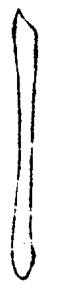

==============
直画法
==============

直画须横入笔锋。直画起锋处不用力，虽极短不得直。

侧起、衂落、成点、顿 :sub:`下行`、提走、力行、顿 :sub:`轻`、围满、提挫 :sub:`斜`、衂、重顿 :sub:`足`、提趯。

.. image:: ../images/zhihuafa.jpg
   :align: center

逆锋横入，取势在画之外。

横笔成点。

逆笔法，将指推笔，直上寸许，落下得之。

起势不欲直，直则无力。趯锋不知挫，无从衂。

------------
垂露
------------

如露之欲垂而复缩。用笔欲疾，疾则力劲。

右围收直，锋挫过左。左围满抢。

------------
垂露变法
------------

法有长短，此法用于伐、仁等字。

------------
努
------------

侧锋顾右至顿，行笔乃直下

------------
悬针
------------

用笔欲徐，徐则意足。

末锋少驻，引而伸之，空抢上收。

大约直之在中者，用悬针；直之在旁者，用垂露。

------------
上尖
------------

用以接上

------------
曲头
------------

头用一曲，取意在包右。臣、門等用之。

------------
直分五停
------------

侧抢，或左或右，随笔意之向背

由上而下，则笔到下画尽处，又须逆回向上。一去一来，皆有两到。

平两画用意略同，图见下。

----

凡直画先看字势向背所宜。逆抢笔锋用力少驻，而下行则直。背在右者为努，“申”字中竖则努而悬针也，“事”中竖则努而随趯也。向则努而向也，背则努而背也，非另有一笔。