========================================
点法
========================================

侧起、衂落、驻、挫、蹲、围转、衂顿、出锋。

.. image:: ../images/dianfa.jpg
   :align: center 

锋向右而势向左，按笔收锋在内而出之。

八法第一笔，所谓侧不愧卧也。

------------------------
点意
------------------------

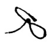

反揭侧下，其笔墨精；中坠徐徐，反揭出锋。

宀头用之，避其旁点。

------------------------
点拖
------------------------

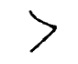

点拖无势，亦不顾右。可偶一用之，以避章法之相类。

------------------------
向左点
------------------------

.. image:: ../images/xiangzuodian.jpg
   :align: center

点后向左一拖。

------------------------
向右点
------------------------

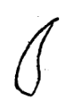

收笔围转至左，又从尖头出去。

------------------------
直点
------------------------

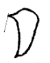

如小直。

------------------------
两向点
------------------------

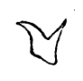

心、以等字中一点用之。其法先一点，后缩上一挑。

------------------------
长点
------------------------

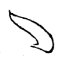

“不”字用之。

------------------------
顾左顾右点
------------------------

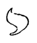

略同直点，笔意稍横。

------------------------
曲抱点
------------------------

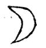

戈、尤等字用之。

------------------------
勾点
------------------------

.. image:: ../images/goudian.jpg
   :align: center

点带勾以收束其右。“厶”等用之。

------------------------
平点
------------------------

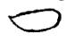

势平。斗用之。

------------------------
向上点
------------------------

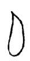

冖、忄第一笔用之。

------------------------
带下点
------------------------

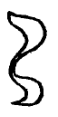

首点带下，次点接上带下。冬、寒用之。

水旁上二点，亦用此法

------------------------
点挑
------------------------

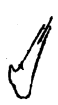

水旁末笔。

------------------------
三点水偏旁
------------------------

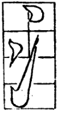

下点之趯锋，应上点之尾点。分阴阳向背，有上下相承之意。

------------------------
微点
------------------------

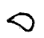

朩、衤等旁，末笔用之。

------------------------
啄点
------------------------

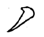

“曾”头用之。

------------------------
关三点
------------------------

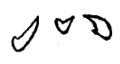

中点用带，恭等用之。

------------------------
合三点
------------------------

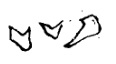

两旁如曾头，中用带。

------------------------
背四点
------------------------

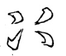

左右相配，黍、羽等字用之。

------------------------
聚四点
------------------------

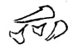

上点似横撇，冒下三点。舜、受等字头用之。