======================
撇法
======================

.. note::

    指法用送

-----------
长直撇
-----------

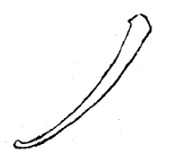

末锋飞起、笔须送到。

手根悬起，和笔俱行，则婉转有力。若以手根着纸斜拂，有半途拨出之病。

-----------
短直撇
-----------

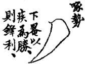

凡撇必用回锋起。先将笔从下至上，便无多头，此短直撇，“亻”旁等用之。

----------------
曲抱撇
----------------

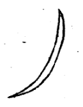

用尖起，曲曲抱左，如文、欠、戈等字用之。

----------------
曲头撇
----------------

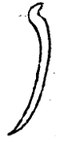

曲头所以包右，“凡”字等用之。

----------------
长曲撇
----------------

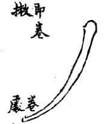

笔心至卷处。

右向左之势为卷撇。当以轻劲取胜。

势曲而长，“少”字用之。

----------------
悬戈撇
----------------

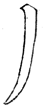

用、月等字从之。

----------------
竖撇
----------------

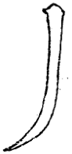

此撇竟如一直。须渐渐撇开去，夫、月、史等字用之。

----------------
短回锋撇
----------------

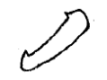

两撇不可一概出锋。故首撇先用回锋。如多、冬之类。

----------------
上尖撇
----------------

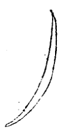

上用尖起，所以接上。广、皮等字用之。

----------------
平撇
----------------

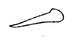

取势先从尖处起，便不垂下。千、重等字用之。

----------------
长回锋撇
----------------

.. image:: ../images/changhuifengpie.jpg
   :align: center

长撇有不宜出锋者，亦用回锋。如破、朋之类。

----------------
兰叶撇
----------------

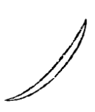

撇有宜以尖接者，如未、東之类。

----------------
三曲撇
----------------

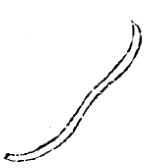

