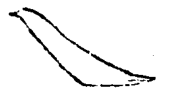

==============
捺法
==============

--------------
竖捺
--------------

.. note::

   谓之纵波

直分五停

捺法顾左，在下半截带起卷意，与左撇配。

蹲锋徐行，势力开展，意足顿出，复遒劲而顾左。

此捺直下，如大、夫等字用之。

----------
平捺
----------

.. note::

   谓之横波

横分五停

起处似作仰画，不蹲以锋，旁裹空蹲，三面力到，顺指欹下，力满微驻。仰出三过，笔中又有三过，如水波之起伏。平捺载上，辶等用之。

---------
侧捺
---------

既不若平捺之载上，又不若竖捺之趣下，侧在中间。是、定等字用之。

------------
反捺
------------

凡字有两捺者，一用反捺，如途、逾之类。

---------
曲头捺
---------

又、入等字用之。

---------
短捺
---------

捺短而势曲，比、能等字用之。

------------
金刀
------------

直出如刀削。

----------
漫游鱼
----------

