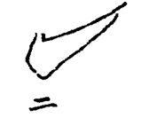
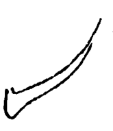
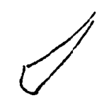
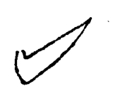

===========
挑法
===========

---------
平挑
---------

凡挑必有两角，其第二角尤须显出。所以足其势也。此挑势平。“土”旁用之。

---------
长曲挑
---------

长以接右，曲以补空。氏、衣、民等字用之。

---------
横挑
---------

此挑势横。“扌”旁等用之。

----------
微挑
----------

此挑不用两角。浙、迎等字用之。