==========
钩法
==========

----------
长钩
----------

即趯也。法也详直画图内。此论出三角法。

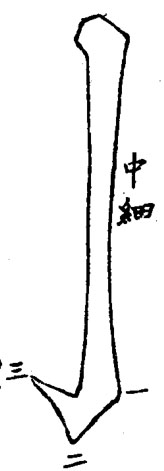

王虚舟先生论欧阳公书法点画俱示棱角，以便初学也。得法之后，去方就圆，亦易易耳。

勾凡三角，要在中间向右一宕，得了第一角；次向下弯，然后缩笔向上，左趯出连作三笔写出。

--------
平勾
--------

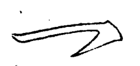

此勾向下。

---------
横勾
---------

即横戈。

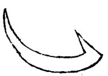

此勾两向里。

------------
右昂取势
------------

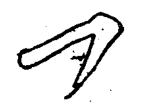

及、阝等用之。

----------
勾努
----------

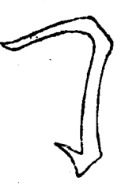

----------
背抛
----------

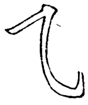

上面转角须出中间细宕。

----------
反振勾
----------

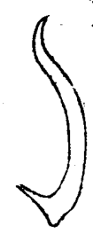

此勾先向右，反振起。“犭”旁用之。

----------
向右勾
----------

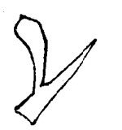

此勾必先向左一宕，得出方趯得进。

----------
直藏锋勾
----------

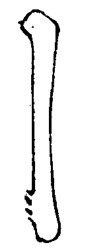

勾有不宜出锋者，须藏其锋。如林、梧之类。

----------
平藏锋钩
----------

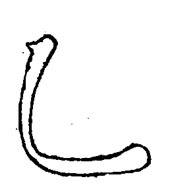

浮鹅有不宜出锋者，亦用藏锋。如流、此等末笔用之。

----------
托勾
----------

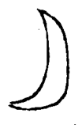

上面字多者，末勾须托住。如寧、亭之类。

----------
圆勾
----------

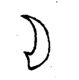

此勾一路圆转。“阝”旁等用之。

----------
长曲勾
----------

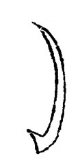

势长而曲。子、乎等字用之。

----------
浮鹅
----------

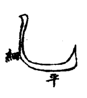

中必细，下必平，三角包满。

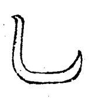

二王浮鹅，便一路圆转。

----------
包勾
----------

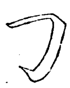

此勾包在左，力、匀等从之。

----------
戈
----------

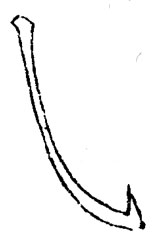

稍直失之拙，过弯失之柔。

头必直，中必细。形如强努。勾必三角。

----------
斜勾末重
----------

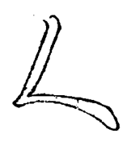

----------
斜勾末轻
----------

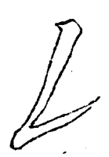

