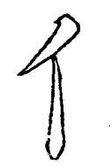
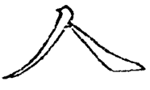
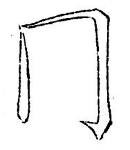
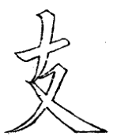
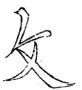
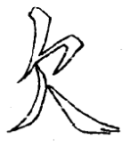
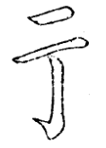

=============
接笔法
=============

凡字中左与右相接、上与下相接必有一定之处。所谓斗榫接缝也。接处多用尖笔。

------------
一尖接
------------

-------------
两尖接
-------------

接有不宜重头者，必用两尖接。

-------------
三尖接
-------------

三笔末锋在一处。

-------------
四尖接
-------------

-------------
五尖接
-------------

五笔在一处，须用五尖。

-------------
两并遥尖接
-------------

如“行”字右旁第一画，不可用折，又不可用竖接，当以尖遥接左旁。

