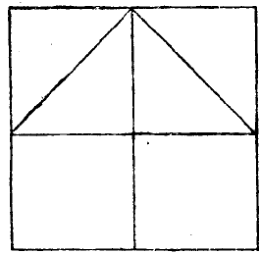
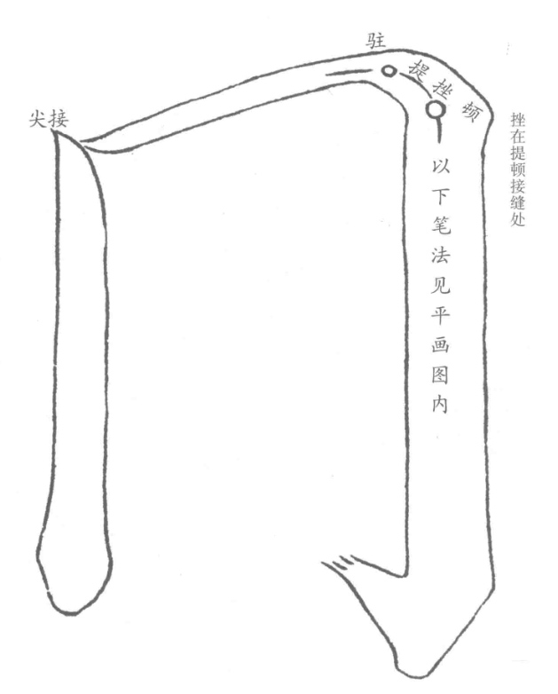
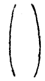

======================================
撇捺平直转折用意诸法
======================================

盖下之字，左右宜乎均分。法界四方格作十字，以半斜界画两角。学者作盖下字[#f1]_，撇捺之意，俱在黑线上。如會、合、金、舍等字头用意，不离此法。自无过不及之弊矣。

----------------
围转
----------------

转角之妙，在驻、提、挫、顿四字。又以仰笔覆收意，转笔至顿亦妙。

笔之轻细者为阳，粗者为阴。一字有两直者，宜左细右粗。

-----------------
向意
-----------------

-----------------
背意
-----------------

-----------------
上放下收
-----------------

-----------------
上收下放
-----------------

收放，即开合也。

-----------------
仰
-----------------

-----------------
覆
-----------------

-----------------
纵波意
-----------------

捺凡三曲，一曲藏而不露。

-----------------
横波意
-----------------

凡从“几”之字，上下均放中，用直为柱，则欹斜之病。

用法如：

-----------------
背抛意
-----------------

-----------------
直画勾
-----------------

凡字平直、画之多者，可以类推

-----------------
平画勾
-----------------

凡平画先学匀，再求错综变化。

-----------------
斜勾意
-----------------

两笔相借以取势也。

凡

----

.. [#f1] 这里的断句读起来并不通顺，或者是我本人理解不了，很有可能是我断句有误。