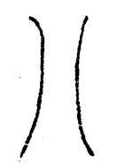
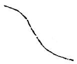
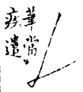

======================================
撇捺平直转折用意诸法
======================================

.. image:: ../images/fajiesifangge.jpg
   :align: center

盖下之字，左右宜乎均分。法界四方格作十字，以半斜界画两角。学者作盖下字[#f1]_，撇捺之意，俱在黑线上。如會、合、金、舍等字头用意，不离此法。自无过不及之弊矣。

----------------
围转
----------------

.. image:: ../images/weizhuan.jpg
   :align: center

转角之妙，在驻、提、挫、顿四字。又以仰笔覆收意，转笔至顿亦妙。

笔之轻细者为阳，粗者为阴。一字有两直者，宜左细右粗。

-----------------
向意
-----------------

.. image:: ../images/xiangyi.jpg
   :align: center

-----------------
背意
-----------------

-----------------
上放下收
-----------------

-----------------
上收下放
-----------------

收放，即开合也。

-----------------
仰
-----------------

.. image:: ../images/yang.jpg
   :align: center

-----------------
覆
-----------------

-----------------
纵波意
-----------------

捺凡三曲，一曲藏而不露。

-----------------
横波意
-----------------

凡从“⺇”之字，上下均放中，用直为柱，则欹斜之病。

用法如：

.. image:: ../images/fajiesifangge.jpg
   :align: center

-----------------
背抛意
-----------------

-----------------
直画匀
-----------------

凡字平直、画之多者，可以类推

-----------------
平画匀
-----------------

凡平画先学匀，再求错综变化。

-----------------
斜勾意
-----------------

两笔相借以取势也。

凡㇛、㇙、㇌、⺄、乛、乙之类笔意用法略同

-----------------
意㇇
-----------------

策掠意连。

-----------------
意㇜
-----------------

啄用卷，与波首连络

-----------------
撇捺相应
-----------------

虽然不连，神气相接，形势相对，笔法相生。如人手足，如鸟舒翼。

-----------------
意彳
-----------------

-----------------
意亍
-----------------

-----------------
平两画意
-----------------

一画由左而右，笔到右画尽处，略一停顿，周回到左然后转出第二笔，所谓两到。

-----------------
平三画
-----------------

上仰下覆，中用勒以接上起下。

-----------------
川字
-----------------

左右用背意，中直如行书；或用向意，中用带。

----

.. [#f1] 这里的断句读起来并不通顺，或者是我本人理解不了，很有可能是我断句有误。