===============
字病
===============

-----------------------------------------
《多宝塔碑》平画住处用点
-----------------------------------------

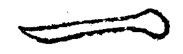

-----------------------------------------
《多宝塔碑》宝盖用点
-----------------------------------------

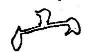

-----------------------------------------
柳散水第三点
-----------------------------------------

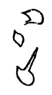

-----------------------------------------
落肩脱节
-----------------------------------------

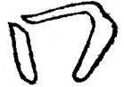

-----------------------------------------
牛头
-----------------------------------------

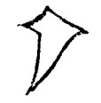

-----------------------------------------
鹤膝
-----------------------------------------

.. image:: ../images/hexi.jpg
   :align: center

-----------------------------------------
鼠尾
-----------------------------------------

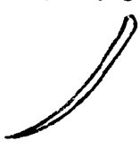

-----------------------------------------
蜂腰
-----------------------------------------

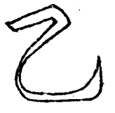

-----------------------------------------
竹节
-----------------------------------------

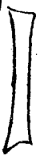

-----------------------------------------
折木
-----------------------------------------

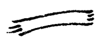

-----------------------------------------
棱角
-----------------------------------------

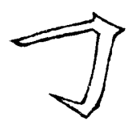

-----------------------------------------
柴担
-----------------------------------------

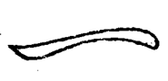
