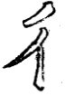
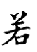

========================
第一部分 [#n1]_
========================

法详点画圈内。亦须活看，大概中间字多者宜开，字少者宜窄。

.. image:: ../images/mingling.jpg
   :align: center

--------

相接处宜密，右多者撇尾忌长，右少者撇横而尾长。

--------

首撇平而直，用回锋；次撇曲而长，出锋。次撇之起，头顶首撇中间。

--------

右勾有一直，故左撇亦带直相映。

--------

点挑相应，神气一贯。

--------

右边字少者宜长，右边字多者宜短。

--------

两点直下，微作拗势，下点作垂露意。

--------

“口”在旁者，缺一角以让右。

--------

“口”在下者，左略长以见柱，右平载上。

--------

中撇悠扬。

--------

中小直既要接左，又须起上。

--------

“力”在右者宜长而狭以抱左。

--------

.. image:: ../images/li2.jpg
   :align: center

“力”在下者宜阔而短以载上。

--------

“山”在旁者缺一角以让右。

--------

“山”在上者，左右须收束向里。

--------

“山”在下者，宜出以载上。

--------

中间字少者，上画长以冒之。

--------

中间字多者，下画长以载之。

--------

“阝”在左者，宜狭以让右，住处用垂露。相让之字，切忌侵占。

--------

“阝”在右者，宜阔而长以配右，住脚用悬针。

--------

“卩”旁阔大以配左。

--------

右点要收束向里。

---------

画左尖长以冒下，下撇亦以尖接。

---------

撇带直以藏点挑。

---------

.. [#n1] 这个标题是我自己加的，原书没有。因为全放一个页面的话，太长了，不方便阅读，所以拆开