========================
第二部分
========================

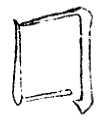

上下画俱宜细。

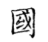

--------

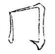

左用两尖接

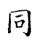

--------

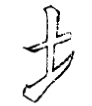

画用右尖，避挑起之重也。

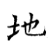

--------

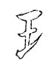

首画两尖，中用小勒。

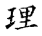

--------

.. image:: ../images/fanwenpang.jpg
   :align: center

首撇用回锋。

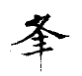

--------

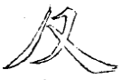

两撇不可一顺。故第一撇回兰叶，第二撇用卷势，且次撇收、藏、让。前撇与捺相应。

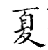

--------

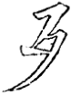

点头掩首撇之锋。

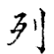

--------

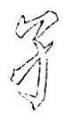

首笔之起与挑脚齐。

.. image:: ../images/sun.jpg
   :align: center

--------

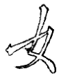

挑左宜以冒下，撇尾亦用长。

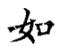

--------

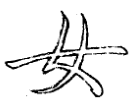

两撇尖起以接上，下脚须配齐。

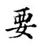

--------

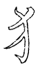

勾用反势，便挽得住。

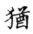

--------

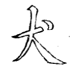

画右短以让点。

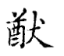

--------

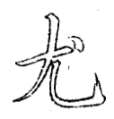

撇头直，撇尾短藏；右点曲抱，下勾平。

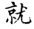

--------

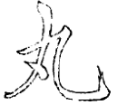

撇尾短，点须藏。

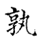

--------

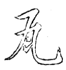

瓦中二画化为点挑。

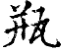

变休作瓦，左末竖藏撇内。

--------

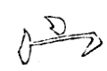

右勾须与左点相配，故勾锋向下。

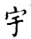

--------

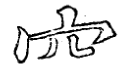

左撇作一变，以配右勾，方得齐平。

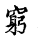

--------

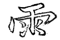

首画两尖、中四点，要相应而不相碍。

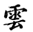

--------

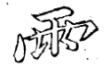

下截字多者，将四点藏于“冖”头之上。

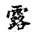

此减写法

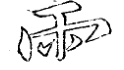

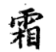

--------

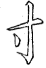

中点带直，方能补其空处。

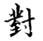

--------

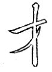

撇从右起，须用尖笔。

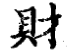

--------

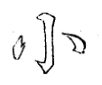

左右须紧抱。

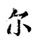

--------

.. image:: ../images/xiao2.jpg
   :align: center

右多一点，故左点要长，将右中一点细藏。

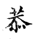

