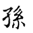
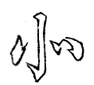

========================
第二部分
========================

.. image:: ../images/fangkuang.jpg
   :align: center

上下画俱宜细。

.. image:: ../images/guo.jpg
   :align: center

--------

左用两尖接

--------

画用右尖，避挑起之重也。

--------

.. image:: ../images/wangzipang.jpg
   :align: center

首画两尖，中用小勒。

.. image:: ../images/li3.jpg
   :align: center

--------

.. image:: ../images/fanwenpang.jpg
   :align: center

首撇用回锋。

--------

两撇不可一顺。故第一撇回兰叶，第二撇用卷势，且次撇收、藏、让。前撇与捺相应。

.. image:: ../images/xia.jpg
   :align: center

--------

点头掩首撇之锋。

.. image:: ../images/lie.jpg
   :align: center

--------

首笔之起与挑脚齐。

--------

挑左宜以冒下，撇尾亦用长。

--------

两撇尖起以接上，下脚须配齐。

--------

勾用反势，便挽得住。

--------

画右短以让点。

--------

撇头直，撇尾短藏；右点曲抱，下勾平。

--------

撇尾短，点须藏。

--------

瓦中二画化为点挑。

变休作瓦，左末竖藏撇内。

--------

右勾须与左点相配，故勾锋向下。

--------

左撇作一变，以配右勾，方得齐平。

--------

首画两尖、中四点，要相应而不相碍。

--------

下截字多者，将四点藏于“冖”头之上。

此减写法

--------

中点带直，方能补其空处。

--------

撇从右起，须用尖笔。

--------

左右须紧抱。

--------

右多一点，故左点要长，将右中一点细藏。

