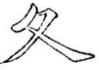
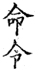

========================
第二部分
========================

上下画俱宜细。

--------

.. image:: ../images/shangbankuang.jpg
   :align: center

左用两尖接

.. image:: ../images/tong.jpg
   :align: center

--------

.. image:: ../images/titupang.jpg
   :align: center

画用右尖，避挑起之重也。

.. image:: ../images/di.jpg
   :align: center

--------

首画两尖，中用小勒。

--------

首撇用回锋。

.. image:: ../images/feng.jpg
   :align: center

--------

.. image:: ../images/fanwenpang2.jpg
   :align: center

两撇不可一顺。故第一撇回兰叶，第二撇用卷势，且次撇收、藏、让。前撇与捺相应。

--------

.. image:: ../images/daizipang.jpg
   :align: center

点头掩首撇之锋。

--------

.. image:: ../images/zizipang.jpg
   :align: center

首笔之起与挑脚齐。

.. image:: ../images/sun.jpg
   :align: center

--------

.. image:: ../images/renzitou.jpg
   :align: center

法详点画圈内。亦须尖看，大概中间字多者宜开，字少者宜窄。

--------

.. image:: ../images/renzitou.jpg
   :align: center

法详点画圈内。亦须尖看，大概中间字多者宜开，字少者宜窄。

--------

.. image:: ../images/renzitou.jpg
   :align: center

法详点画圈内。亦须尖看，大概中间字多者宜开，字少者宜窄。

--------

.. image:: ../images/renzitou.jpg
   :align: center

法详点画圈内。亦须尖看，大概中间字多者宜开，字少者宜窄。

--------

.. image:: ../images/renzitou.jpg
   :align: center

法详点画圈内。亦须尖看，大概中间字多者宜开，字少者宜窄。

--------

.. image:: ../images/renzitou.jpg
   :align: center

法详点画圈内。亦须尖看，大概中间字多者宜开，字少者宜窄。

--------

.. image:: ../images/renzitou.jpg
   :align: center

法详点画圈内。亦须尖看，大概中间字多者宜开，字少者宜窄。

--------

.. image:: ../images/renzitou.jpg
   :align: center

法详点画圈内。亦须尖看，大概中间字多者宜开，字少者宜窄。

--------

.. image:: ../images/renzitou.jpg
   :align: center

法详点画圈内。亦须尖看，大概中间字多者宜开，字少者宜窄。

--------

.. image:: ../images/renzitou.jpg
   :align: center

法详点画圈内。亦须尖看，大概中间字多者宜开，字少者宜窄。

--------

.. image:: ../images/renzitou.jpg
   :align: center

法详点画圈内。亦须尖看，大概中间字多者宜开，字少者宜窄。

--------

.. image:: ../images/renzitou.jpg
   :align: center

法详点画圈内。亦须尖看，大概中间字多者宜开，字少者宜窄。

--------

.. image:: ../images/renzitou.jpg
   :align: center

法详点画圈内。亦须尖看，大概中间字多者宜开，字少者宜窄。

--------

.. image:: ../images/renzitou.jpg
   :align: center

法详点画圈内。亦须尖看，大概中间字多者宜开，字少者宜窄。

--------

.. image:: ../images/renzitou.jpg
   :align: center

法详点画圈内。亦须尖看，大概中间字多者宜开，字少者宜窄。

--------

.. image:: ../images/renzitou.jpg
   :align: center

法详点画圈内。亦须尖看，大概中间字多者宜开，字少者宜窄。

