================
第三部分
================

----------------

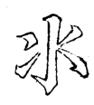

勾贵下长，左右相配。

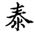

----------------

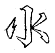

左点亦长以配右。

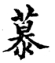

----------------

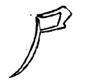

上画与左撇用两尖接，撇亦带直。

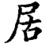

----------------

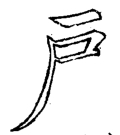

上带平，右第一科峰须带直。

.. image:: ../images/fang.png
   :align: center

----------------

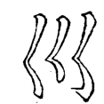

下三点左右相向，中则短藏。

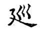

----------------

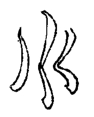

左直向左，中直作一曲向右，此变法也。

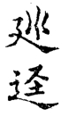

又减写法

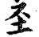

----------------

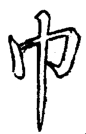

“巾”在下者，左右须相配。

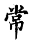

----------------

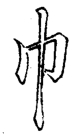

“巾”在旁者，左直微长，右勾微短，直画中间要细。

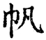

----------------

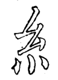

首撇长而左挑出，下撇则短藏，三点左右相向，中用直点，以还本体。

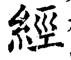
 
----------------

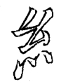

上撇首短，下撇首长，仍藏三点，一路向右。此乃变法也。

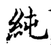

----------------

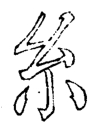

“糸”在脚者，上撇要短细。

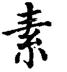

----------------

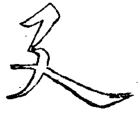

起笔尖长以冒下，中用两尖接。

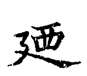

----------------

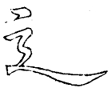

“⻎”中曲忌断。上边字少者，点与捺俱平。

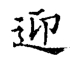

----------------

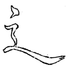

 上边字多者，点与捺俱侧。

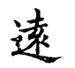

----------------

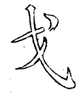

头必直，中必细，点抱一画之头，撇亦抱向里。

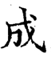

----------------

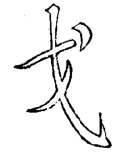

“戈”有不宜开者，须直下以靠左。

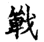

----------------

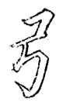

中竖似回锋，撇化【须确认】法。

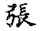

----------------

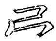

左竖似撇外向，便与右勾相配。

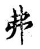

----------------

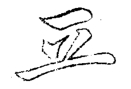

中间化点。

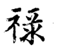

----------------

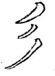

首撇平而直，次则收锋，三则长曲以抱左。

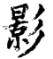

----------------

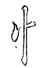

右点如一小直，方与左相配。

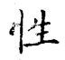

----------------

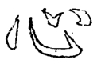

中勾稍短，右点宜出以冒钩。

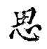

----------------

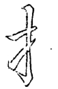

“亅”中间微细，画左长以冒下勾。左右有两勾，右用绰勾以避复。

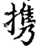

----------------

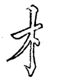

画右尖以让右，下一小点或上或下，须看右边之字画。

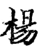
