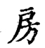

================
第三部分
================

----------------

.. image:: ../images/shui1.jpg
   :align: center

勾贵下长，左右相配。

----------------

左点亦长以配右。

----------------

上画与左撇用两尖接，撇亦带直。

----------------

上带平，右第一科峰须带直。

----------------

下三点左右相向，中则短藏。

----------------

左直向左，中直作一曲向右，此变法也。

又减写法

----------------

.. image:: ../images/jin1.png
   :align: center

“巾”在下者，左右须相配。

----------------

“巾”在旁者，左直微长，右勾微短，直画中间要细。

----------------

首撇长而左挑出，下撇则短藏，三点左右相向，中用直点，以还本体。

 
----------------

上撇首短，下撇首长，仍藏三点，一路向右。此乃变法也。

----------------

“糸”在脚者，上撇要短细。

----------------

起笔尖长以冒下，中用两尖接。

----------------

“⻎”中曲忌断。上边字少者，点与捺俱平。

----------------

 上边字多者，点与捺俱侧。

----------------

头必直，中必细，点抱一画之头，撇亦抱向里。

----------------

“戈”有不宜开者，须直下以靠左。

----------------

中竖似回锋，撇化【须确认】法。

----------------

左竖似撇外向，便与右勾相配。

----------------

中间化点。

----------------

首撇平而直，次则收锋，三则长曲以抱左。

----------------

右点如一小直，方与左相配。

----------------

中勾稍短，右点宜出以冒钩。

----------------

.. image:: ../images/tishoupang.png
   :align: center

“亅”中间微细，画左长以冒下勾。左右有两勾，右用绰勾以避复。

----------------

画右尖以让右，下一小点或上或下，须看右边之字画。

