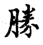

================
第四部分
================

----------------

两木不宜生。勾左须藏其锋。

----------------

三笔在一处，用三尖接。

.. image:: ../images/gu.png
   :align: center

----------------

四尖接，下撇须宕出，意在抱左。

----------------

五尖接，撇包左，捺舒使意足。

----------------

两撇尖锋相接，次撇宜细而直，以让左也。

----------------

道点向左而长撇用斜，悬针。

----------------

首画左长，中二小画上短下长。

----------------

右直微长，左挑微出，中画化为点，亦忌板。

----------------

中二画化为点挑，方能向右。

----------------

.. image:: ../images/qizitou.png
   :align: center

中间竟作一平点，不呆板。

----------------

中间字多者，撇与勾微直下。

----------------

中间字少者，撇与勾俱平。

----------------

中撇宜直，三点攒一处。

----------------

右边“火”字，左点作两向势，便能联络。

----------------

上撇冒下捺，与中直相接。

----------------

左右两点相向，中二点两向，作带意。

----------------

三点向右，右一点向左。

----------------

上下俱开，中间须收紧。

----------------

左边俱要收束。

----------------

二王爿法，一点向上，直后挑。

----------------

.. image:: ../images/jiangzipang2.png
   :align: center

左作点挑，亦一法也。

.. image:: ../images/zhuang.png
   :align: center

----------------

左作一直一挑，“壮”、“状”等字用之，以配右也。

----------------

上画左尖，以点接住。

----------------

撇尾不宜长出。

