==============================
第五部分
==============================

----------------

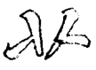

两小画向上，切不可平，欲其冒下也。

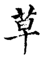

----------------

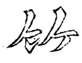

左点向右，右作一撇向左，是一气且不碍下。

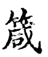

----------------

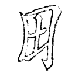

“田”作偏旁甚板，作斜势以活之。

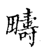

----------------

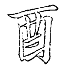

“酉”旁甚板，将下一画作一挑以向右。

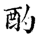

----------------

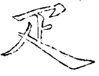

中间“卜”宜细，下撇紧从中出。

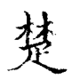

----------------

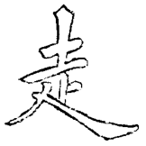

画右俱短，便已让右。

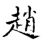

变法：

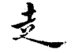

----------------

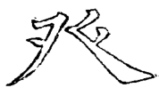

撇捺冒下，上边笔画须配合。

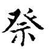

----------------

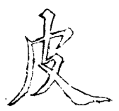

左撇尖细，右撇要藏。

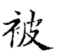

----------------

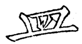

中二直化为点撇。

.. image:: ../images/gai.png
   :align: center

----------------

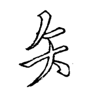

两撇直下，点小而藏

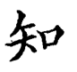

----------------

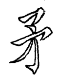

中点末用尖，下勾亦以尖。接气贯而接脉亦清楚

.. image:: ../images/wu2.png
   :align: center

----------------

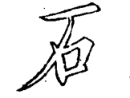

画左尖长以冒下，左直出头以接之

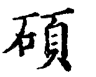

----------------

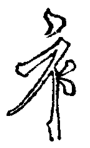

画左长以冒下撇，竖即让点，部位点须善藏，竖意仍对上点

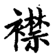

----------------

.. image:: ../images/shizibian.png
   :align: center

下点在两笔接缝中

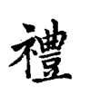

----------------

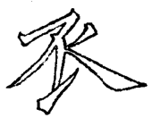

中直要细，下截用笔向左宕出；捺之起笔，与直相接

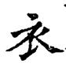

----------------

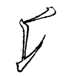

直之上节曲，头起即向左宕；用笔稍重，至下节笔轻带出一挑，挑须长而曲

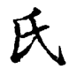

----------------

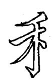

上撇要平，画左长以冒下

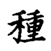

----------------

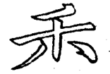

左撇右捺，与直相悬，欲其清也

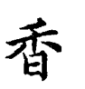

----------------

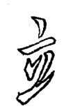

右点尖长以联上下

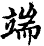

----------------

.. image:: ../images/mi.png
   :align: center

 左长以冒下，左撇不宜长

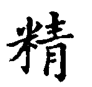

----------------

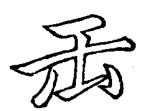

上画两尖，勒画也

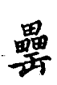

----------------

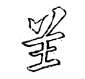

左点长以配右撇，上画长以冒下。“曾”头亦用之

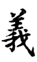

----------------

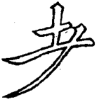

次画左宜长而曲，右宜短而细

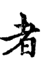

----------------

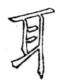

画左尖长以冒下挑

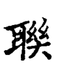
