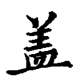
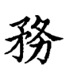
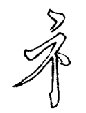
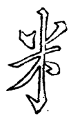

==============================
第五部分
==============================

----------------

两小画向上，切不可平，欲其冒下也。

----------------

左点向右，右作一撇向左，是一气且不碍下。

----------------

“田”作偏旁甚板，作斜势以活之。

----------------

“酉”旁甚板，将下一画作一挑以向右。

----------------

中间“卜”宜细，下撇紧从中出。

----------------

画右俱短，便已让右。

变法：

----------------

撇捺冒下，上边笔画须配合。

.. image:: ../images/ji.png
   :align: center

----------------

左撇尖细，右撇要藏。

----------------

中二直化为点撇。

----------------

两撇直下，点小而藏

----------------

中点末用尖，下勾亦以尖。接气贯而接脉亦清楚

----------------

画左尖长以冒下，左直出头以接之

----------------

画左长以冒下撇，竖即让点，部位点须善藏，竖意仍对上点

----------------

下点在两笔接缝中

.. image:: ../images/li4.png
   :align: center

----------------

中直要细，下截用笔向左宕出；捺之起笔，与直相接

----------------

直之上节曲，头起即向左宕；用笔稍重，至下节笔轻带出一挑，挑须长而曲

----------------

上撇要平，画左长以冒下

.. image:: ../images/zhong.png
   :align: center

----------------

左撇右捺，与直相悬，欲其清也

----------------

右点尖长以联上下

----------------

 左长以冒下，左撇不宜长

----------------

上画两尖，勒画也

----------------

左点长以配右撇，上画长以冒下。“曾”头亦用之

----------------

次画左宜长而曲，右宜短而细

----------------

画左尖长以冒下挑

